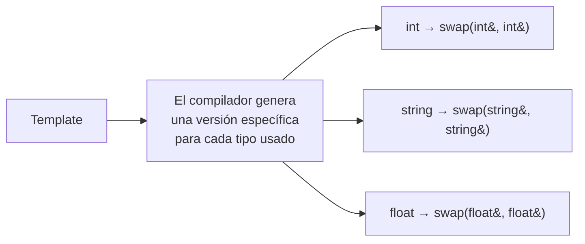
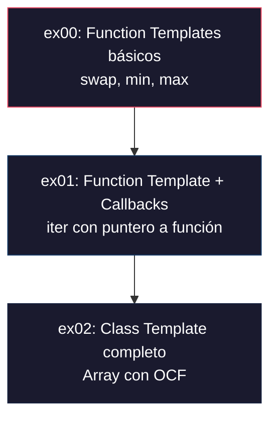
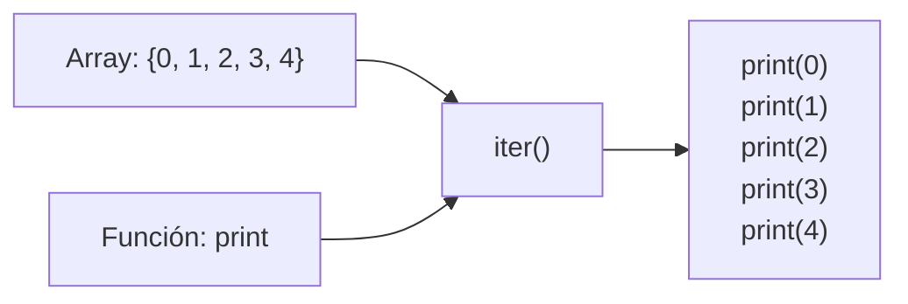
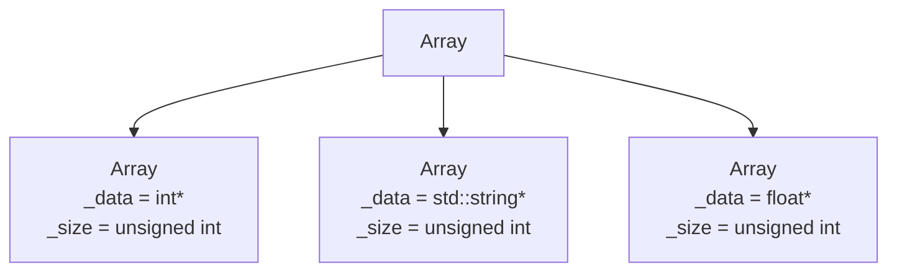
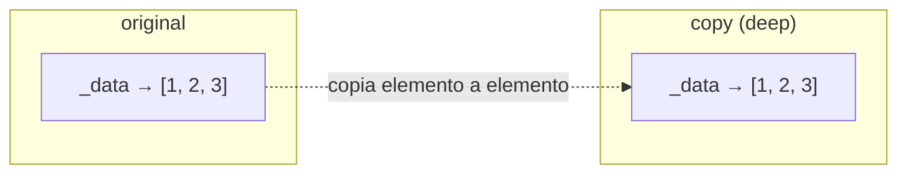
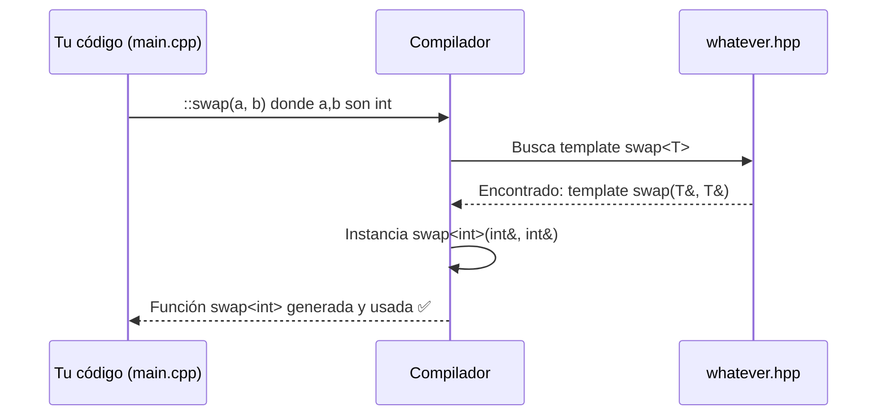
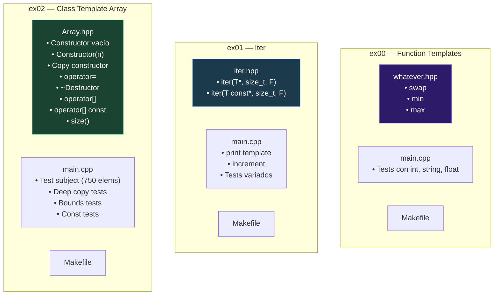

# 🗺️ Roadmap CPP Module 07 — Templates en C++

## ¿Qué es este módulo?

Este módulo trata sobre **templates** (plantillas) en C++98. Los templates son la herramienta de C++ para escribir **código genérico**: código que funciona con cualquier tipo sin tener que reescribirlo para cada uno.



> [!NOTE]
> **Concepto clave**: Un template NO es una función/clase real. Es un **molde**. El compilador crea la función/clase real cuando tú lo **instancias** con un tipo concreto (ej: `swap<int>`).

---

## Progresión del módulo



---

# Exercise 00: Function Templates básicos

## Archivo: [whatever.hpp](file:///home/miguel/Escritorio/github/Cpps/Cpp_07/ex00/include/whatever.hpp)

### `swap` — Intercambio de valores

```cpp
template <typename T>
void swap(T &a, T &b)
{
    T tmp = a;
    a = b;
    b = tmp;
}
```

**Línea por línea:**

| Línea | Qué hace | Por qué |
|-------|----------|---------|
| `template <typename T>` | Declara que `T` es un tipo genérico | El compilador sustituirá `T` por el tipo real (`int`, `string`, etc.) |
| `void swap(T &a, T &b)` | Recibe **referencias** a dos valores del mismo tipo | Las referencias permiten **modificar los originales**, no copias |
| `T tmp = a;` | Guarda el valor de `a` en una variable temporal | Si no guardamos `a`, lo perdemos al hacer `a = b` |
| `a = b;` | Asigna el valor de `b` a `a` | — |
| `b = tmp;` | Asigna el valor guardado (antiguo `a`) a `b` | — |

> [!TIP]
> **¿Por qué `T &` y no `T`?** Si usáramos `T` (por valor), recibiríamos **copias** y los originales no se modificarían. La referencia `&` es fundamental aquí.

### `min` — Retorna el menor

```cpp
template <typename T>
T const &min(T const &a, T const &b)
{
    return (a < b ? a : b);
}
```

| Concepto | Detalle |
|----------|---------|
| `T const &a` | Recibe por **referencia constante**: no copia, no modifica |
| `T const &` (retorno) | Retorna una referencia al original, sin copiar |
| `a < b ? a : b` | Si `a` es menor, retorna `a`. Si son iguales, `a < b` es `false` → retorna `b` (el segundo) |

> [!IMPORTANT]
> **Punto clave de evaluación**: El subject dice "si son iguales, retorna el **segundo**". Con `a < b ? a : b`:
> - `a < b` → true → retorna `a` (el menor) ✅
> - `a == b` → false → retorna `b` (el segundo) ✅
> - `a > b` → false → retorna `b` (el menor) ✅

### `max` — Retorna el mayor

```cpp
template <typename T>
T const &max(T const &a, T const &b)
{
    return (b < a ? a : b);
}
```

Misma lógica invertida:
- `b < a` → true → `a` es mayor → retorna `a` ✅
- `b == a` → false → retorna `b` (el segundo) ✅
- `b > a` → false → `b` es mayor → retorna `b` ✅

### El main de ex00: [main.cpp](file:///home/miguel/Escritorio/github/Cpps/Cpp_07/ex00/src/main.cpp)

```cpp
::swap(a, b);        // :: = scope global, evita conflicto con std::swap
::min(a, b);         // :: = scope global, evita conflicto con std::min
```

> [!NOTE]
> **¿Por qué `::swap` y no `swap`?** El prefijo `::` fuerza a usar el **namespace global**. Sin él, el compilador podría confundir tu `swap` con `std::swap` si hay un `using namespace std`. Es buena práctica.

---

# Exercise 01: Iter — Function Template con Callbacks

## Archivo: [iter.hpp](file:///home/miguel/Escritorio/github/Cpps/Cpp_07/ex01/include/iter.hpp)

### Concepto: ¿Qué es `iter`?

`iter` es una función que **recorre un array y aplica una función a cada elemento**. Es el equivalente manual de `std::for_each` (que no puedes usar porque STL está prohibida hasta M08).



### Versión non-const (para arrays modificables)

```cpp
template <typename T, typename F>
void iter(T *array, size_t const length, F func)
{
    for (size_t i = 0; i < length; i++)
        func(array[i]);
}
```

| Elemento | Significado |
|----------|-------------|
| `typename T` | Tipo de los elementos del array |
| `typename F` | Tipo de la función/functor a aplicar |
| `T *array` | Puntero al primer elemento (non-const → se puede modificar) |
| `size_t const length` | Longitud del array, pasada como const (no se modifica) |
| `F func` | La función que se aplica. `F` puede ser un puntero a función, un functor, etc. |
| `func(array[i])` | Llama a `func` pasándole el elemento `i` |

> [!TIP]
> **¿Por qué `typename F` y no `void (*func)(T &)`?** Usar `typename F` es más flexible: acepta **cualquier callable** — funciones normales, function templates instanciados, functors. Si usaras un puntero a función fijo, perderías flexibilidad.

### Versión const (para arrays de solo lectura)

```cpp
template <typename T, typename F>
void iter(T const *array, size_t const length, F func)
{
    for (size_t i = 0; i < length; i++)
        func(array[i]);
}
```

La única diferencia es `T const *array` → los elementos no se pueden modificar. Esto permite usar `iter` con arrays declarados como `const`:

```cpp
int const arr[] = {10, 20, 30};
::iter(arr, 3, print<int>);  // usa la versión const
```

> [!IMPORTANT]
> **Pregunta de evaluación**: "¿Por qué dos sobrecargas?"
> 
> **Respuesta**: El subject dice que la función del tercer parámetro puede recibir su argumento por `const reference` o `non-const reference`. Si solo tuvieras la versión non-const (`T *array`), no podrías pasar un array `const int[]` porque el compilador no puede convertir `const int*` a `int*`. La sobrecarga const resuelve esto.

### El main de ex01: [main.cpp](file:///home/miguel/Escritorio/github/Cpps/Cpp_07/ex01/src/main.cpp)

```cpp
template <typename T>
void print(T const &x)           // función template genérica
{
    std::cout << x << std::endl;
}

void increment(int &x)           // función normal (non-const ref)
{
    x += 1;
}

::iter(arr1, 5, print<int>);     // print<int> = instanciación explícita
::iter(arr4, 3, increment);      // función que modifica los elementos
::iter(arr3, 3, print<int>);     // arr3 es const → usa sobrecarga const
```

> [!NOTE]
> `print<int>` es una **instanciación explícita** del function template `print`. Al escribir `<int>`, le dices al compilador "genera la versión de `print` para `int`" y pasas un puntero a esa función concreta.

---

# Exercise 02: Class Template Array

## Archivo: [Array.hpp](file:///home/miguel/Escritorio/github/Cpps/Cpp_07/ex02/include/Array.hpp)

Este es el ejercicio más complejo. Combina **class templates** con la **Orthodox Canonical Form (OCF)**.

### ¿Qué es un Class Template?

Es una clase donde el tipo de los datos es genérico:



### Atributos privados

```cpp
private:
    T            *_data;     // puntero al array dinámico
    unsigned int  _size;     // número de elementos
```

### Orthodox Canonical Form (OCF)

La OCF requiere 4 funciones especiales. Aquí están las 4:

#### 1. Constructor por defecto

```cpp
Array() : _data(new T[0]()), _size(0) {}
```

| Detalle | Explicación |
|---------|-------------|
| `new T[0]()` | Asigna un array de 0 elementos. Es legal en C++. |
| Los `()` en `new T[0]()` | **Value initialization**: inicializa los elementos a su valor por defecto (0 para int, "" para string) |
| `_size(0)` | Array vacío |

#### 2. Constructor paramétrico

```cpp
Array(unsigned int n) : _data(new T[n]()), _size(n) {}
```

Crea un array de `n` elementos, todos inicializados por defecto gracias a `()`.

> [!TIP]
> **Pregunta de evaluación**: "¿Qué pasa si haces `int *a = new int()` vs `int *a = new int`?"
> 
> **Respuesta**: Con `()` se hace **value initialization** → `*a` vale `0`. Sin `()` se hace **default initialization** → `*a` tiene un valor basura/indeterminado. El subject te da esta pista.

#### 3. Constructor de copia (deep copy)

```cpp
Array(const Array &other) : _data(new T[other._size]()), _size(other._size)
{
    for (unsigned int i = 0; i < _size; i++)
        _data[i] = other._data[i];
}
```



**¿Por qué deep copy?** Si hicieras `_data = other._data` (shallow copy), ambos objetos apuntarían al **mismo bloque de memoria**. Al destruir uno, el otro tendría un **dangling pointer** → crash.

#### 4. Operador de asignación (deep copy)

```cpp
Array &operator=(const Array &other)
{
    if (this != &other)              // ① Self-assignment guard
    {
        delete[] _data;              // ② Libera la memoria actual
        _size = other._size;         // ③ Copia el tamaño
        _data = new T[_size]();      // ④ Asigna nueva memoria
        for (unsigned int i = 0; i < _size; i++)
            _data[i] = other._data[i]; // ⑤ Copia elemento a elemento
    }
    return *this;                    // ⑥ Retorna referencia para encadenar (a = b = c)
}
```

> [!IMPORTANT]
> **Pregunta de evaluación**: "¿Qué pasa si no pones el `if (this != &other)`?"
>
> **Respuesta**: Si haces `arr = arr` (self-assignment), primero harías `delete[] _data` y luego intentarías leer de `other._data`... ¡que es el mismo puntero que acabas de liberar! → **use-after-free** → crash o corrupción.

#### 5. Destructor

```cpp
~Array() { delete[] _data; }
```

Libera la memoria asignada con `new[]`. Siempre `delete[]` para arrays.

### operator[] — Acceso con bounds checking

#### Versión non-const (lectura + escritura)

```cpp
T &operator[](int i)
{
    if (i < 0 || static_cast<unsigned int>(i) >= _size)
        throw std::out_of_range("Array index out of bounds");
    return _data[i];
}
```

#### Versión const (solo lectura)

```cpp
T const &operator[](int i) const
{
    if (i < 0 || static_cast<unsigned int>(i) >= _size)
        throw std::out_of_range("Array index out of bounds");
    return _data[i];
}
```

| Detalle | Explicación |
|---------|-------------|
| Parámetro `int i` (no `unsigned int`) | Permite **detectar índices negativos** como `-2` (el test del subject prueba `numbers[-2]`) |
| `static_cast<unsigned int>(i)` | Convierte `i` a unsigned para comparar con `_size` sin warnings de signed/unsigned |
| `throw std::out_of_range(...)` | Lanza una excepción que hereda de `std::exception` (como pide el subject) |
| `T &` vs `T const &` | Non-const permite escribir (`arr[0] = 5`), const solo leer |
| `const` al final de la función | Permite llamar a `operator[]` en instancias `const Array` |

> [!TIP]
> **Pregunta de evaluación**: "¿Por qué dos versiones de `operator[]`?"
>
> **Respuesta**: Si tienes un `const Array<int> arr`, solo puede llamar a funciones miembro marcadas como `const`. Sin la versión const de `operator[]`, no podrías ni leer los elementos de un array constante.

### `size()` — Getter constante

```cpp
unsigned int size() const { return _size; }
```

El `const` al final garantiza que no modifica la instancia. Retorna `unsigned int` como pide el subject.

---

# Resumen: Conceptos Clave para la Evaluación

## Preguntas que te pueden hacer y sus respuestas

| Pregunta | Respuesta |
|----------|-----------|
| **¿Qué es un template?** | Un molde genérico. El compilador genera código específico para cada tipo con el que se usa. |
| **¿Dónde se definen los templates?** | En los **headers** (.hpp), porque el compilador necesita ver la definición completa para instanciarlos. |
| **¿Qué es la instanciación de un template?** | El proceso por el cual el compilador genera una versión concreta del template para un tipo específico (ej: `swap<int>`). |
| **¿Por qué `new T[n]()` y no `new T[n]`?** | Los `()` hacen **value initialization**: ints a 0, strings vacías, etc. Sin ellos, los valores serían basura. |
| **¿Qué es deep copy vs shallow copy?** | Deep copy: cada objeto tiene su propia memoria independiente. Shallow copy: comparten el mismo puntero → peligroso. |
| **¿Por qué self-assignment guard?** | Sin él, `a = a` haría `delete[]` de la memoria y luego intentaría leerla → undefined behavior. |
| **¿Por qué `int` y no `unsigned int` en `operator[]`?** | Para poder detectar índices negativos como `-2`. Con `unsigned`, el `-2` se convertiría silenciosamente en un número enorme. |
| **¿Qué es `size_t`?** | Un tipo unsigned definido en `<cstddef>`, usado para tamaños y índices. Es portable y siempre suficiente para el tamaño máximo de un objeto en memoria. |
| **¿Por qué dos sobrecargas de iter?** | Una para arrays `const` (solo lectura) y otra para non-const (modificables). Sin la sobrecarga const, no podrías iterar un `const int[]`. |
| **¿Por qué retornar `T const &` en min/max?** | Para evitar copias innecesarias y retornar una referencia directa al objeto original. |

## Flujo de compilación de un template



---

## Mapa de archivos del proyecto


